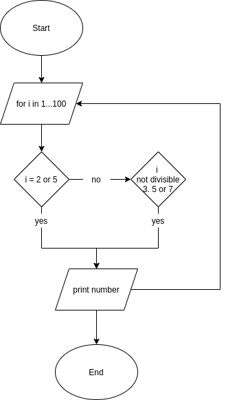

# T1A1 - Workbook

**Q01**

* ***Usenet*** Starting out as a collection of Bourne Shell scripts (The
precursor to BASH) by two university students, "Tom Truscott" & "Jim Ellis". And
going public in 1980. Usenet is the earliest example of what a modern internet
user may recognize as the internet.

* ***Tim Berners-Lee***

* ***Y2K***

* ***Web 2.0***

* ***Dot-com Bubble***

---

**Q02**

* ***Packets***

* ***IP Address (IPv4 & IPv6)***

* ***Routers & Routing***

* ***Domains & DNS***

---

**Q03**

* ***TCP***

* ***HTTP & HTTPS***

* ***Web Browsers***

---

**Q04**

* **Array:** An array is an integer indexed ordered list of elements. An array
is created with ```Array.new``` or ```array = [x, 1, "hello"]``` using square
bracket notation. Arrays are used when a developer wishes to collect data under
a single name or when the order of elements is important.

* **Hash** A hash is an unorderd list using key-value pairs. Meaning that each
element is accesd via its associated key instead of an integer. A hash is
created with ```Hash.new``` or ```hash = {:name => "Adam", :age =>"30"}```
using curly brace notation. Hashes are used to store elements with the associated
name similiar to the structre of a dictionary

* **Set** A set is an unorderd values without duplicates. And has many attributes
with both hashes and arrays.

---

**Q05**

---

**Q06**

---

**Q07**

---

**Q08**

*'Control Flow'* is a term within computer science to refer to the order with
which instructions within an imperative program are executed and evaluated. In
the **Ruby** programming language this is achieved with; *If Statements*, *Case
Statements*, *Loops (while, until for)*, and the *each method*. For example;
```
x = gets.to_i
y = gets.to_i

if x > y then
    puts "#{x} is greater"
elsif y > x then
    puts "#{y} is greater"
else
    puts "#{x} and #{y} are equal"
end
```
In this simple script after the program takes the two inputs from the user it
then encounters the beginning of the control flow at the *if statement* the next
line to be executed is dependant on the values of x & y. The machine has 3
branches of options to evaluate, choosing only one.

---

**Q09**

*Type Coercion* is the methods used to transform one data type into another. In
ruby two of these methods are;

* ***to_i*** which returns the object as an interger
* ***to_s*** which returns the object as a string

These methods are used throughout ruby code from getting user input to moving
around arrays and the data within them.

---

**Q10**

The *'Ruby Programming Language'* like most languages has a number of different
data types. Namely *'Numbers (Integers & Floats)'*, *'Strings'*, *'Boolean'*,
*'Symbols'*, *'Arrays'*, and *'Hashes'*. The simplest types are numbers and
strings;
```
8, 3.14159, "Hello World"
```
These are examples of integers, floating point numbers or decimal numbers and a
string. The more complex types are *'Arrays'* and *'Hashes'*;
```
array = [1, 2, 3]
hash = {:a => 1, :b => 2, :c => 3}
```
*Arrays* are an ordered set of data indexed at 0. To access an array the syntax
is;
```
puts array[1]
```
which will print out the second element *2*. Whereas a *hash* is collection
of unique keys and values. To access a hash the syntax is;
```
puts hash[:c]
```
which will print out the third element *3*. The key difference between arrays
and hashes is, A hash may use any object as its key whereas an array only uses
the assigned integer.

---

**Q11**

I would use the following classes;

* ***Menu:*** Holds the information on each food item including name, price and
availability

* ***Customer:***  Able to create new or retreive existing customer details
including adderess and payment

* ***Order:*** Stores information on which customer orders what items.

* ***Delivery:*** Customer and Order information for delivery.

---

**Q12**

After writing out the ruby code from question 12 the first attempt at running it
produced the following error.

```q12.rb:2:in '<main>': undefined method '/' for...```


Changing line one from "celsius = gets" to "celsius = gets.to_f" produced the
correct output. The gets method recives the users input saved as the variable
celcius. When the user enters a number the gets method receives from standard
input a string. The calculation on line 2 can not be done to strings. The
method to_f returns the result of gets as a floating point number which will
allow the calculaton to run and prevent any rounding errors that would have been
produced by to_i.

___

**Q13**

```
arr = [5, 22, 29, 39, 19, 51, 78, 96, 84]
i = 0
while (i < arr.size - 1 && arr[i] < arr[i + 1])
    i = i + 1
end
x = arr[i]
arr[i] = arr[i + 1]
arr[i + 1] = x
puts arr

```
___

**Q14**



***Pseudocode***

```
loop start
    range 1 to 100
    if number equals 2 or 5
    print the number
    otherswise if the number is od and not 1
    if number is not divisible by 5, 3, and 7
    print the number
Loop End

```

***Ruby Code***
```
for i in 1..100 do
  if i == 2 || i == 5
    puts i
  elsif i.odd? && i != 1
    if i % 5 != 0 && i % 3 != 0 && i % 7 != 0
      puts i
    end
  end
end

```
___

**Q15**
```
puts "weather checker"
puts "Whats the Temp in c"
temp = gets.to_i
puts "Is it raning yes/no"
rain = gets.chomp

case rain
when "y", "Y", "yes", "Yes"
  rain = true
when "n", "N", "no", "No"
  rain = false
end

if rain == true && temp < 15
  puts "It's wet and cold"
elsif rain == false && temp < 15
  puts "It's not raining but cold"
elsif rain == false && temp >= 15
  puts "It's warm but not raining"
else
  puts "It's warm and raining"
end

```
___

**Q16**

```
skills = ["Python", "Ruby", "Bash", "Git", "HTML", "TDD", "CSS", "JavaScript"]
skillValue = [1,2,4,8,16,32,64,128]
userScore = Array.new
codeScore = Array.new

for i in 0...skills.length do
  puts "What is your skill in #{skills[i]}"
  ans = gets.chomp.to_i
  userScore.push(ans)
end

for i in 0...userScore.length do
  val1 = skillValue[i]
  val2 = userScore[i]
  total = val1 * val2
  codeScore.push(total)
end

totalScore = codeScore.sum

skillWeight = Hash[skills.zip(skillValue)]
result = Hash[skills.zip(codeScore)]

puts "-------------------------------------"
puts "Your total score is #{totalScore}"
puts "--------------------------------------"
puts "Your lowest skill is #{codeScore.min}"
puts "--------------------------------------"
result.each do |l, s|
  puts "#{l} : #{s}"
end
puts "--------------------------------------"
puts "The weight for each skill is"
skillWeight.each do |s, v|
  puts "#{s} : #{v}"
end
puts "--------------------------------------"
```
